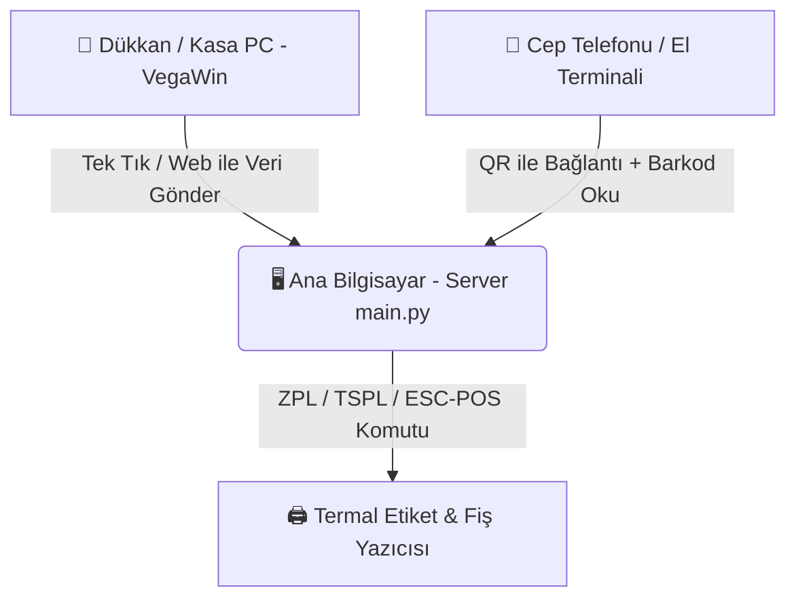

# 🏷️ ETİKET VE FİŞ YAZDIRICI - MİMARİ VE ÇALIŞMA PLANI

> **Proje Amacı:** VegaWin sisteminden güncel stok ve fiyat verilerini ağ üzerinden sisteme aktarmak; cep telefonundan QR kod ile bağlanarak rafta barkod okutulduğunda ana bilgisayara bağlı termal yazıcıdan anında etiket ve fiş çıkartmak.

---

## 🏗️ 1. GENEL SİSTEM MİMARİSİ

### 1.1. Cihaz Rolleri & Sorumluluklar:
1. **Ana Bilgisayar (Server & Yazıcı Merkezi):**
   - `python main.py` ile tek tıkla çalışır (FastAPI / Flask mimarisi).
   - Termal etiket yazıcısı ve fiş yazıcısı doğrudan bu bilgisayara USB / Ağ üzerinden bağlıdır.
   - Tüm ürün ve fiyat verilerini yerel SQLite veritabanında (WAL modu ile) güvenle tutar.
   - Yerel ağ IP'sini (`http://192.168.1.X:8000`) ve QR kodunu ana ekranda yayınlar.

2. **Dükkan / Kasa PC (VegaWin Kaynağı):**
   - Hiçbir ağır kurulum veya uyumluluk problemi gerektirmez.
   - Tarayıcıdan Ana PC'nin IP adresine girer veya masaüstündeki hafif tek tık scripti kullanır.
   - **"VegaWin Verilerini Gönder"** butonuna basıldığında VegaWin'deki güncel stok/fiyat verilerini Ana PC'ye post eder.

3. **Mobil Terminal (QR Bağlantılı Barkod & Etiket Ekranı):**
   - Ana ekrandaki QR kodu telefon kamerasıyla taranır.
   - Kamera veya kablosuz barkod okuyucu ile raftaki ürün barkodu okutulur.
   - Barkod okunduğu anda ürün adı ve güncel fiyatı ekranda belirir ve **Ana PC'deki yazıcıdan otomatik etiket basılır**.

---

## 🔍 2. VEGAWIN İNCELEMESİ VE PC DOSYA YOLLARI

VegaWin ve Faster POS kurulumlarında ürünler ve fiyatlar aşağıdaki konumlarda tutulur ve aktarılır:

| Dosya / Veri Türü | Tipik Windows PC Yolu | Açıklama |
| :--- | :--- | :--- |
| **VegaWin Ana Dizini** | `C:\VegaWin\` veya `C:\VEGA\` veya `D:\VegaWin\` | Program ve yardımcı kütüphanelerin ana klasörü. |
| **VegaWin Veri / Model** | `C:\VegaWin\Data\` (`M2000.MDL`, `S2005.SQL`) | SQL Server ve sistem şablon modelleri. |
| **VegaWin Excel / CSV Çıktısı** | `C:\VegaWin\Export\` veya `Masaüstü` | VegaWin'den dışa aktarılan güncel stok/fiyat Excel listesi. |
| **Faster POS Log & Satış** | `C:\VegaWin\Bin\FasterLog\` | Kasa ve terminal günlük log dosyaları. |
| **MS SQL Server Veritabanı** | `localhost\VEGAWIN` veya `localhost\SQLEXPRESS` (`VEGA2024`, `VEGA2025`, `S2024`) | VegaWin'in ürün, barkod (`STOK`, `STOKBARKOD`, `STOKFIYAT`) tabloları. |

---

## 🚀 3. GELİŞTİRİLECEK MODÜLLER VE EKRANLAR

### 1. `Ana Sunucu & Yönetim Ekranı` (Masaüstü Web UI):
- **Canlı QR Bağlantı Paneli:** Mobil cihazların anında bağlanması için yerel IP QR kodu.
- **Yazıcı Seçici & Canlı Durum:** USB / Ağ termal yazıcı seçimi, karanlık ayarı, ofset ayarları.
- **Hızlı Etiket & Fiş Baskı Masası:** Tekli ve toplu etiket basımı, manuel ürün arama.
- **Şablon Editörü:** Etiket boyutları (40x58, 60x40, 76x40 vb.) ve görsel tasarım şablonları.

### 2. `VegaWin Senkronizasyon İstasyonu` (Web & Ağ Entegrasyonu):
- **Web Üzerinden Tek Tıkla Gönder:** Ağdaki herhangi bir bilgisayar veya kasadaki tarayıcıdan dosya seçip gönderme.
- **Hafif Senkronizasyon Ajanı (Opsiyonel):** VegaWin dışa aktarılan klasörünü tek tıkla sisteme aktaran yardımcı betik.

### 3. `Mobil Barkod & Etiket Terminali` (Telefon Web Arayüzü):
- **Kamera ile Anlık Barkod Okuma:** QuaggaJS / ZXing tabanlı yüksek hızlı kamera tarayıcı.
- **Tek Tuşla Baskı & Otomatik Baskı Modu:** Barkod okunduğu anda beklemeden ana yazıcıdan etiket çıkarma.
- **Adet & Fiyat Kontrolü:** Raftaki fiyat ile kasadaki fiyatı anında karşılaştırma.

---

## 🛡️ 4. KALİTE VE KORUMA STANDARTLARI (TASLAK UYUMLU)
- **F5 Anti-Caching:** Önbellek sorunsuz anlık yenilenme.
- **Zero AI Slop:** Rafine, profesyonel, modern dokunsal tasarım (Obsidian Slate teması).
- **Otomatik Port Kurtarma:** 8000 portu meşgulse çökmeden bir sonraki portu açma.
- **Zero Code Truncation:** Tüm kodlar eksiksiz ve modüler.
