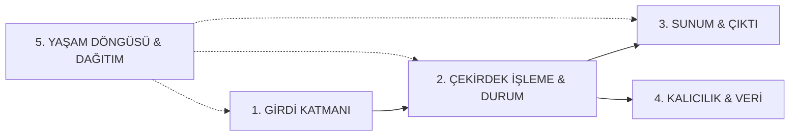

# 🌌 03. Evrensel İlk İlkeler ve Sınırsız Proje Motoru (Universal First-Principles Framework)

> **BU DOKÜMANIN AMACI:**  
> Yapay zekayı belirli şablonlara veya sınırlı proje listelerine hapsetmek DEĞİLDİR.  
> Kullanıcının aklına gelebilecek **HERHANGİ BİR ŞEYİ** (Kitap Okuyucu, 3D Model Görüntüleyici, POS, Instagram, Müzik Sentezleyici, P2P Dosya Paylaşımı, Finansal Tarayıcı, Medikal Görüntüleme, Simülasyon, Oyun vb.) sıfır sürtünmeyle ve ilk ilkelerden (first-principles) üretebilmesini sağlayan **Evrensel Mühendislik Çatısıdır**.

---

## 🧬 1. Her Yazılımın Evrensel Çekirdeği: "IPO-I Modeli"

Dünyadaki her yazılım, konusu ne olursa olsun şu 4 temel sütundan oluşur. Yapay zeka her yeni projeyi bu evrensel modele oturtur:

### 1. Girdi Katmanı (Inputs):
* **Dosya/Medya:** PDF, EPUB, FB2, STL/OBJ (3D), MP3/WAV (Ses), MP4/MKV (Video), CSV/Excel, JSON, SQLite, RAW.
* **Donanım/Sensör:** Klavye/Mouse, Barkod Okuyucu, Mikrofon, Kamera, Seri Port (COM/USB), Gamepad.
* **Ağ/Protokol:** REST API, WebSocket, WebRTC, P2P Soketler, Web Scraper.
* **Kullanıcı:** Formlar, Tıklamalar, Tuval (Canvas) Çizimleri, Sürükle-Bırak, Kısayol Tuşları.

### 2. Çekirdek İşleme & Mantık (Processing & Engine):
* **Dönüştürücüler:** Metin çıkarma, Ses sentezleme (TTS), Görüntü işleme (OpenCV/Pillow), 3D render.
* **İş Mantığı:** Hesaplama, filtreleme, algoritmalar, zamanlayıcılar, kurallar.
* **Zeka (AI):** Yerel LLM (Ollama), Gömme (Embedding), Çok Modlu (Vision/Audio).

### 3. Sunum & Kullanıcı Deneyimi (Presentation & UI/UX):
* **Tuval / Özel Görselleştirme:** HTML5 Canvas, WebGL/Three.js, Ses Spektrum Dalgası (Wavesurfer), Kitap Sayfalama (Epub.js / Turn.js), Harita/Grafik.
* **Etkileşimli Arayüz:** Modern Koyu Tema (`#0b0f19`), Ferah Tablolar, Toast Bildirimler, Anlık Arama.
* **Canlı Akış:** SSE / WebSocket ile donmayan daktilo efekti ve ilerleme çubukları.

### 4. Kalıcılık & Durum (State & Persistence):
* **Kalıcı Depo:** SQLite WAL (kilitlenmeyen yerel db), JSON State, Dosya Sistemi (`data/`).
* **Durum Koruma:** `F5` yenilemede kaybolmayan kullanıcı ayarları, okuma konumu veya sepet verileri.

### 5. Yaşam Döngüsü & Dağıtım (Lifecycle):
* **Tek Tıkla Başlatıcı:** `main.py` (Portu yönetir, sunucuyu ve ekranı açar).
* **Masaüstü Paketleme:** `build_exe.py` (`sys._MEIPASS` statik yol korumalı `.exe`).
* **Zarif Kapanış:** Port kilitlenmesi veya arka planda zombie işlem bırakmayan temiz sonlanma.

---

## 🛠️ 2. Daha Önce Hiç Görülmemiş Bir Fikri İnşa Etme Algoritması

Kullanıcı akla gelmedik sıra dışı bir fikir verdiğinde (Örn: *"Bana EPUB kitapları okuyan, arkada yağmur sesi çalan ve yapay zekayla sesli kitaba dönüştüren bir masaüstü aracı yap"*):

Yapay zeka şu 4 adımlı **Otonom İnşa Protokolünü** işletir:

### Adım 1: Alanın En İyi Açık Kaynak Çözümlerini Tespit Et
* EPUB okuma için: `ebooklib` (Python) + `epub.js` (Frontend).
* Ses çalma & sentezleme için: `pygame.mixer` / `sounddevice` / Edge-TTS.
* Arayüz için: İki panel (Sol: Kitaplık/Bölümler, Sağ: Ferah Okuma Tuvali ve Ses Kontrol Barı).

### Adım 2: Çekirdek Motoru (`core/engine.py`) İlk İlkelerden Yaz
* Dosyayı yükle -> Bölümlere ayır -> Son kalınan sayfayı SQLite'a kaydet -> İstenirse metni TTS ile sese dönüştür.

### Adım 3: Kullanıcı Deneyimini Zirveye Taşı
* Göz yormayan Gece Modu (Koyu Gri/Siyah veya Sıcak Sepya seçeneği), font boyutu ayarlayıcı, okuma süresi sayacı, yer imi (bookmark) ekleme.

### Adım 4: Standart Zırhı Giydir
* `main.py` tek tıkla çalıştırsın, `build_exe.py` ile `.exe` yapılabilsin, `docs/klasor.md` envanteri yazılsın, sıfır kırmızı hata ile teslim edilsin.

---

## 💡 3. Her Türlü Fikir İçin Hızlı Mimari Eşleme Matrisi

| Akla Gelen Fikir Türü | Girdi & Donanım | Çekirdek Kütüphane / Motor | Arayüz Tipi | Dağıtım Türü |
| :--- | :--- | :--- | :--- | :--- |
| **Kitap / Doküman Okuyucu** | EPUB, PDF, MOBI, TXT | `ebooklib`, `pypdf`, `edge-tts` | Kitap Sayfası / İki Panel | Masaüstü .EXE / Web |
| **3D Model / CAD İzleyici** | STL, OBJ, GLTF, STEP | `trimesh`, `three.js`, `WebGL` | 3D Etkileşimli Tuval (Canvas) | Web / pywebview .EXE |
| **Ses / Müzik / Podcast Aracı** | MP3, WAV, Mikrofon | `librosa`, `soundfile`, `wavesurfer.js` | Dalga Formu (Waveform) & Player | Masaüstü .EXE |
| **Görsel / Video Düzenleyici** | PNG, JPG, MP4, Kamera | `Pillow`, `OpenCV`, `ffmpeg` | Katmanlı Tuval & Zaman Çizelgesi | Masaüstü .EXE / Web |
| **Finans / Borsa / Kripto Botu** | WebSocket Ticker, REST API | `pandas_ta`, `ccxt`, `matplotlib` | Canlı Mum Grafik Dashboard | Web / Arka Plan Botu |
| **P2P Ağ / Yerel Paylaşım** | Yerel Ağ (LAN), Wi-Fi | `socket`, `zeroconf`, `webrtc` | Cihaz Keşif Listesi & Sürükle-Bırak | Masaüstü .EXE / Web |
| **Simülasyon / Fizik / Oyun** | Klavye, Mouse, Matematik | `pygame`, `matter.js`, `Canvas 2D` | 60 FPS Oyun Tuvali | Masaüstü / Web |
| **Donanım / POS / Barkod** | Barkod Okuyucu, COM Port, Termal | `pyserial`, `python-escpos` | Dokunmatik Hızlı Satış Grid | Masaüstü .EXE |
| **Sosyal / Akış / SaaS Klonu** | Kullanıcı Medyası, Yorumlar | `FastAPI`, `WebSocket`, `Pillow` | Sonsuz Kaydırma (Feed) & Story | Full-Stack Web |

---

## 🏆 4. Nihai İlke: "Yapay Zeka Sınır Tanımaz"
Yapay zeka hiçbir projeye *"Bu benim şablonlarımda yok"* demez. Bu Evrensel IPO-I Modeli sayesinde insan aklının tasarlayabileceği her türlü yazılımı ilk ilkelerden parçalara ayırır, en iyi kütüphaneleri entegre eder ve standart zırhımızla eksiksiz inşa eder.
