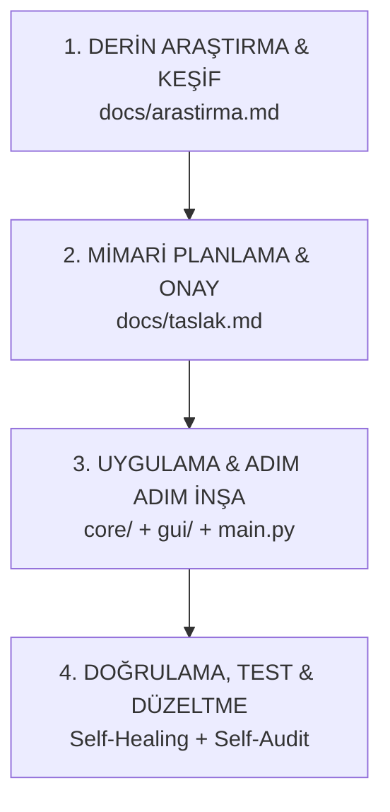

# 🔬 05. Derin Araştırma ve Tersine Mühendislik (Reverse-Engineering) Protokolü

Kullanıcı *"Şu siteyi, şu oyunu veya AutoCAD/Figma gibi bir uygulamanın arayüzünü incele ve en ufak detayına kadar her şeyi çıkar"* dediğinde yapay zekanın uygulayacağı **Aşırı Kapsamlı Araştırma ve Çözümleme Protokolü**.

---

## 🧭 4 Aşamalı Geliştirme Döngüsü (Master Pipeline)

Kullanıcının belirlediği 4 ana aşamanın en kusursuz ve mantıksal sıralaması:

---

## 📑 1. Aşama: Derin Araştırma Raporu Formatı (`docs/arastirma.md`)

Yapay zeka incelenen hedef sistemi (AutoCAD, Instagram, Spotify, Steam, Bir Web Sitesi vb.) şu 6 ana başlıkta atomlarına ayırır:

### 1. Görsel Yerleşim ve UI/UX Anatomisi (Component Breakdown):
* **Üst Menü / Ribbon Bar:** Hangi sekmeler var? (Home, Insert, Annotate, View, Manage).
* **Sol / Sağ Paneller:** Katman Yöneticisi (Layer Manager), Özellikler Tablosu (Properties Inspector), Araç Çubuğu (Toolbar).
* **Ana Çalışma Alanı (Viewport / Canvas):** Sonsuz ızgara (Infinite Grid), eksen göstergesi (UCS Icon), 2D/3D görünüm küpü (ViewCube).
* **Alt Durum Çubuğu (Status Bar):** Anlık fare koordinatları `(X: 142.50, Y: -80.20)`, Yakalama Modu (Snap On/Off), Ölçek (1:100).
* **Komut Satırı / Konsol (CLI):** Klavye kısayollarını ve komut geçmişini yazan dinamik girdi alanı.

### 2. Fonksiyonel Yetenek Matrisi (Feature Matrix):
* **Çizim & Geometri:** Çizgi (Line), Yay (Arc), Çember (Circle), Dikdörtgen (Polyline), Spline, Metin.
* **Düzenleme Araçları:** Taşı (Move), Döndür (Rotate), Kırp (Trim), Aynala (Mirror), Ölçekle (Scale), Patlat (Explode).
* **Hassas Çizim (Object Snap - OSNAP):** Uç nokta (Endpoint), orta nokta (Midpoint), teğet (Tangent), merkez (Center).
* **Katman & Stil Yönetimi:** Katman rengi, çizgi tipi (kesikli/düz), çizgi kalınlığı, görünürlük/kilit.

### 3. Kullanıcı Etkileşimi ve Klavye/Fare Haritası (Input & Gestures):
* `Fare Sol Tık`: Öğe seçimi / Çizim noktası belirleme.
* `Fare Orta Tuş (Scroll Drag)`: Tuvali serbest kaydırma (Pan).
* `Fare Tekerleği (Scroll Up/Down)`: İmlecin bulunduğu noktaya doğru yakınlaşma/uzaklaşma (Zoom at cursor).
* `Klavye Komutları`: `L + Enter` -> Line, `C + Enter` -> Circle, `Z + Enter` -> Zoom, `Ctrl + Z` -> Geri Al (Undo).

### 4. Veri Modeli ve Dosya Formatları (Data Architecture):
* **Vektör Varlık Yapısı (Entity Model):** Her nesnenin tipi, koordinat dizisi, katman ID'si, renk kodu ve kalınlık verisi.
* **Geri Alma Ağacı (Undo/Redo Stack):** Yapılan her geometrik işlemin bellek üzerindeki durum geçmişi.
* **Dışa Aktarma / İçe Aktarma:** `.dxf`, `.dwg`, `.svg`, `.json`, `.png` desteği.

### 5. Teknoloji ve Kütüphane Eşleştirme (Tech Stack Selection):
* **Web Tabanlı ise:** `Three.js` (3D) veya `Canvas 2D / Fabric.js / Konva.js` (2D Vektör Tuvali) + FastAPI Backend + `ezdxf` (DXF parser).
* **Masaüstü .EXE ise:** `PySide6` (`QGraphicsView` / `QGraphicsScene` / `OpenGLWidget`) veya `pywebview`.

### 6. Aşama Aşama Klonlama / Geliştirme Yol Haritası (Milestones):
* **Faz 1 (MVP):** Sonsuz ızgara tuvali, fare ile yakınlaşma/kaydırma (Pan/Zoom) ve temel çizgi çizme.
* **Faz 2:** Seçim motoru, silme, nesne yakalama (Snap) ve alt komut konsolu.
* **Faz 3:** Katman sistemi, özellik paneli, DXF dosya yükleme ve dışa aktarma.
* **Faz 4:** Koyu tema cilası, kısayollar ve `.exe` derleme.

---

## 🏛️ 2. Aşama: Mimari Planlama (`docs/taslak.md`)
Araştırma tamamlandıktan sonra kullanıcıya onaylatılacak mimari özet çıkarılır:
* Hedeflenen teknolojiler, klasör yapısı ve seçilen arayüz tipi netleştirilir.
* Kullanıcı *"Onaylıyorum"* dediğinde 3. aşamaya geçilir.

---

## ⚙️ 3. Aşama: Uygulama & Adım Adım İnşa (Implementation)
1. `main.py` ve çekirdek veri motoru (`core/engine.py`) kurulur.
2. Tuval / Arayüz bileşenleri (`frontend/` veya `gui/`) oluşturulur.
3. No-truncation kuralıyla tüm fonksiyonlar eksiksiz yazılır.

---

## 🔁 4. Aşama: Doğrulama, Test & Düzeltme (Iterative Polish)
1. **Self-Healing:** Alınan hatalar otonom düzeltilir.
2. **Self-Audit:** 25 maddelik teslim listesi kontrol edilir.
3. Kullanıcıdan gelen geri bildirimler doğrultusunda sistem genişletilir.
